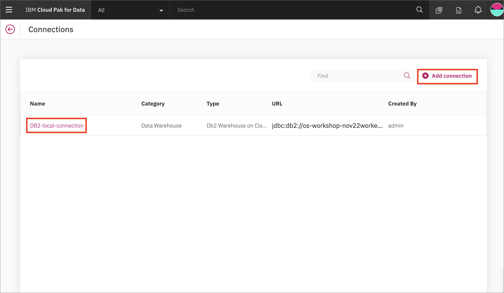

# Exercise 1: Data Analysis

This section is broken up into the following steps:

1. [Virtualize data from multiple source](#2-virtualize-data)
1. [Use Data Refinery to visualize and clean data](#3-use-data-refinery-to-visualize-and-clean-data)

###  Examine the Data Source connection

An admin should have given you access to an instance of DB2 Warehouse, where you have loaded the data in the *Pre-work*.
You can see this connection and any others, as well as adding a new connection, by going to the (☰) hamburger menu and clicking `Connections`:

## 2. (Optional) Virtualize data

> **IMPORTANT**: A note to the instructors of this workshop. At this point go to the [Admin Guide](../admin-guide/README.md#virtualize-db2-data-with-data-virtualization) and follow the `Virtualize Db2 data with Data Virtualization` section.

For this section we'll now use the Data Virtualization tool to import the data from Db2 Warehouse, which is now exposed as an Connection in Cloud Pak for Data.

### Assign the data to your project

From the menu click on *Collections -> Virtualized Data*, you'll be brought to the *My data* section. Here you should see the data that the administrator has assigned to you. Choose the three data sets available and click *Assign* to start importing it to your project.

From here, choose the project you previously created.

Switching to our project should show all three virtualized tables, and two joined tables. Do not go to the next section until this step is performed.

## 3. Use Data Refinery to visualize and clean data

Before we build our model we're going to take a quick detour to the *Data Refinery* tool. Data Refinery can quickly filter and mutate data, create quick visualizations, and do other data cleansing tasks from an easy to use user interface.

### Load the *BILLING* data table into data refinery

From the *Project* home, under the *Assets* tab, click on the *Data assets* arrow to toggle it and open up the list of data assets. Click the box next to *USERxxxx.BILLING* to check it, and click the 3 dots to the right, and then *Refine* :

Data Refinery should launch and open the data like the image below:

Click the `X` by the *Details* button to close it.

The *Operation* button can perform many tasks related to data cleansing such as: substituting values, removing and renaming columns, converting column types, etc.

Clicking on the *Profile* tab will bring up a quick view of several histograms about the data.

Clicking on the *Visualizations* tab will bring up an option to choose which columns to visualize. In this case, we'll pick *TotalCharges*. Click on *Visualize data* when ready.

We can quickly see the data in a histogram by default, switching between different chart types in seconds.

